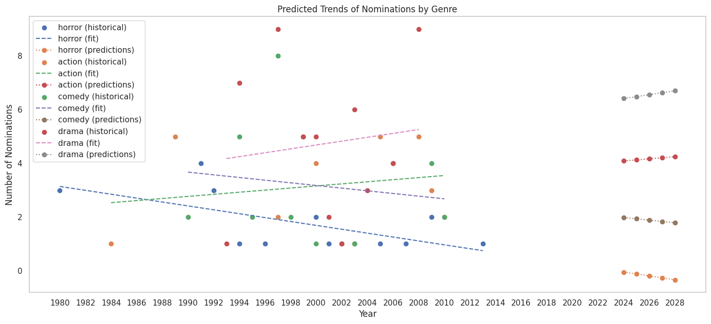

# FilmAffinity Web Scraping Project

### Overview
This project was developed to explore web scraping techniques using **BeautifulSoup**. It focuses on extracting data from the **FilmAffinity** website to analyze Oscar-nominated actors and actresses, identifying their most iconic films by genre.

### Objective
The primary goal of this project is to:
- **Identify** the Oscar-nominated actors and actresses.
- **Categorize** their most famous films by genre.
- **Analyze** trends in film genres related to Oscar-nominated performances.

### Key Features
- **Data Extraction**: The project scrapes film data from FilmAffinity using BeautifulSoup, focusing on actors/actresses who have been nominated for Oscars.
- **Genre Classification**: Automatically classifies the films based on their genre.
- **Oscar-Nominated Performers**: Isolates actors and actresses who have been candidates for an Oscar, providing insights into their most significant works across different genres.
  
### Technologies Used
- **Python**: Core programming language for the project.
- **BeautifulSoup**: Web scraping library used to extract and parse data from HTML.
- **Pandas**: For data manipulation and analysis.
- **Requests**: To fetch HTML content from FilmAffinity.
- **Streamlit**: For creating the interactive web application.

### Results

- **Comprehensive List**: A comprehensive list of Oscar-nominated actors and actresses, along with their most iconic films categorized by genre.
  
- **Nominations by Genre**: The analysis showed that the **drama** genre received the highest number of nominations over the years, followed by **action**, **comedy** and **horror**

  
  *Figure 2: Nominations by Genre over the Years*

- **Trend Analysis**: A linear regression analysis was performed to identify trends in nominations by genre. The results indicated an increasing trend in nominations for the **drama** genre and **action**, while **horror** and **comedy** genre showed a decline in nominations.

  
  *Figure 3: Linear Regression of Nominations by Genre*

- **Top Performers**: The analysis identified the top-performing movies based on the number of nominations. For instance, **"As Good As It Gets"** received the most nominations with **10 nominations**, and the actor with the most nominations is **Jack Nicholson** with 18 nominations.

  | Movie Title         | Year | Genre  | Nominations |
  |---------------------|------|--------|-------------|
  | As Good As It Gets  | 1997 | Comedy | 10          |
  | The Dark Knight     | 2008 | Action | 10          |

  |     Actor      | Nominations |
  |----------------|-------------|
  | Jack Nicholson | 18          |


### Learnings

This project provided hands-on experience with:
- **Web Scraping**: Gained practical skills in web scraping using **BeautifulSoup**, understanding how to navigate HTML structures and extract relevant data.
- **Data Processing and Cleaning**: Learned how to process and clean large datasets using **Pandas**, ensuring the data is ready for analysis.
- **Statistical Analysis**: Developed a foundational understanding of statistical analysis techniques, including linear regression, to identify trends in data.
- **Data Visualization**: Enhanced skills in visualizing data using libraries like **Matplotlib** and **Seaborn**, making it easier to interpret results and communicate findings effectively.
- **Insight Extraction**: Gained insights into the relationships between film genres and Oscar nominations, helping to identify trends and patterns in the film industry.

### How to Use the Streamlit App

1. **Clone the Repository**:
   ```bash
   git clone [https://github.com/GabrielFersPin/FilmAfinnity-Project.git](https://github.com/GabrielFersPin/FilmAffinity.git)
